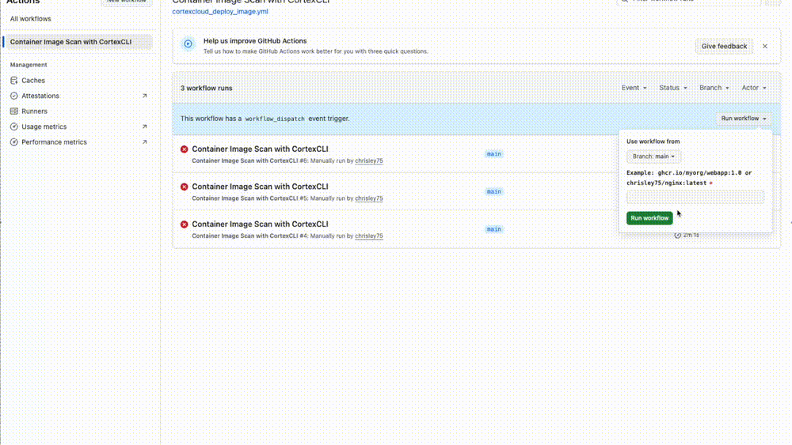

# 🧪 Container Image Scan with CortexCLI

This GitHub Action allows you to **scan a container image** using **CortexCLI** directly from a GitHub workflow.

---




## 🚀 Overview

The workflow performs the following steps:
1. Accepts an image name (e.g. `ghcr.io/myorg/webapp:1.0` or `nginx:latest`)
2. Pulls the container image from its registry
3. Installs all required dependencies
4. Downloads and installs the latest version of **CortexCLI**
5. Runs an **image vulnerability scan** using your Cortex instance

---

## ⚙️ Usage

### 1. Trigger the workflow manually
Go to the **Actions** tab → select **"Container Image Scan with CortexCLI"** → click **"Run workflow"**  
Then provide the container image to scan, for example:

```
ghcr.io/panw-labs/vulappcrtx:0.0.1
```


### 2. Required repository configuration

Define the following variables and secrets:

| Type | Name | Description |
|------|------|--------------|
| Variable | `CORTEX_API_URL` | Cortex API base URL (e.g. `https://api-XXX.xdr.XX.paloaltonetworks.com`) |
| Secret | `CORTEX_API_KEY` | API key for Cortex |
| Secret | `CORTEX_API_KEY_ID` | API key ID |

---

## 🧩 Example Input

```yaml
container_image: ghcr.io/myorg/webapp:1.0
```

## 🧠 Notes

- This workflow runs on `ubuntu-latest` and installs required system packages (`curl`, `jq`, `xz-utils`, `libhyperscan-dev`, `libhyperscan5`).
- The `--timeout 300` option prevents long-running scans from timing out too early.
- You must **create a prevention policy in Cortex** for the CLI scan to work properly:

  > Go to **Vulnerability Management → Prevention → Build Action**
  >  and ensure a policy is defined and active for CLI scans.

- You can extend this workflow to automatically **upload scan results** or **trigger a policy gate**.

## 📄 Further Documentation

To learn more about how Cortex handles application security posture, scan workflows, and integrations across your development and runtime environments, consult the official documentation for **Application Security Posture Management (ASPM)**:
 [ASPM – Palo Alto Networks Cortex Cloud Application Security](https://docs-cortex.paloaltonetworks.com/r/Cortex-Cloud-Posture-Management/Cortex-Cloud-Application-Security/Application-Security-Posture-Management-ASPM?utm_source=chatgpt.com)
 This resource provides detailed information on onboarding VCS/CI/CD systems, defining policies, asset visibility, and remediation workflows.